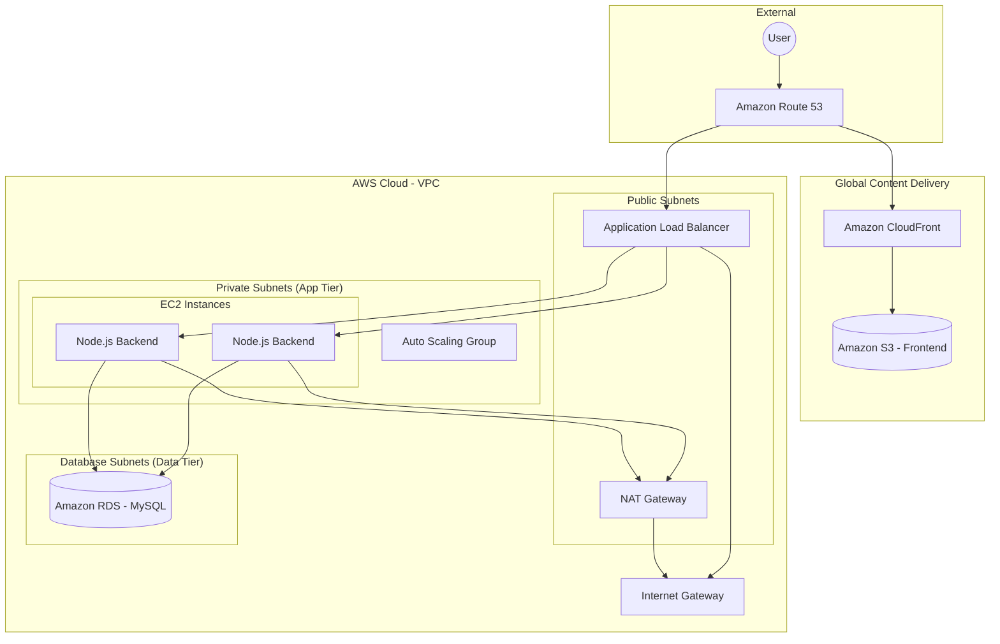

# AWS Three-Tier Web Architecture

[](https://aws.amazon.com/)
[](https://www.terraform.io/)
[](https://reactjs.org/)
[](https://nodejs.org/)
[](https://github.com/Rishi-Cs-ms/aws-three-tier-architecture/actions/workflows/deploy.yml)

This project demonstrates a highly available, scalable, and secure **Three-Tier Web Architecture** deployed on AWS using **Terraform** for Infrastructure as Code (IaC). It features a modern React frontend, a robust Node.js/Express backend, and a managed MySQL database via Amazon RDS.

## 🏗️ Architecture Overview

The application is architected across three distinct tiers, ensuring clear separation of concerns, enhanced security, and independent scalability.



### 1. Presentation Tier (Frontend)
- **Technology**: React.js (Vite)
- **Hosting**: Static assets are stored in **Amazon S3**.
- **Delivery**: Worldwide distribution via **Amazon CloudFront** (CDN) for low latency and SSL termination.
- **Features**: Responsive UI for user management, communicating with the backend API via HTTPS.

### 2. Application Tier (Backend)
- **Technology**: Node.js & Express.js
- **Deployment**: Running on EC2 instances within **Private Subnets**.
- **High Availability**: Managed by an **Auto Scaling Group (ASG)** across multiple Availability Zones.
- **Load Balancing**: An **Application Load Balancer (ALB)** distributes incoming traffic and handles health checks.
- **Security**: EC2 instances are not directly accessible from the internet; they only accept traffic from the ALB.

### 3. Data Tier (Database)
- **Technology**: Amazon RDS (MySQL)
- **Deployment**: Isolated in **Private Database Subnets**.
- **Security**: Accessible only from the Application Tier security group.

## 🛠️ Infrastructure as Code (Terraform)

The entire infrastructure is automated using Terraform, organized into modular components:

- `vpc/`: Provisions the VPC, Public/Private subnets, Internet Gateway, and NAT Gateway.
- `alb/`: Configures the Application Load Balancer, Target Groups, and Listeners.
- `autoscaling/`: Sets up Launch Templates and Auto Scaling Groups for the backend servers.
- `rds/`: Provisions the managed MySQL database instance.
- `security-groups/`: Defines granular firewall rules for each tier.

## 🚀 Key Features

- **Scalability**: Automatically scales the backend instances based on traffic demands.
- **Fault Tolerance**: Multi-AZ deployment ensures the application remains available even if one AZ fails.
- **Security Best Practices**:
    - Use of Private Subnets for App and Data tiers.
    - NAT Gateway for secure outbound internet access for private instances.
    - Least-privilege Security Group rules.
- **Automated Deployment**: One-command infrastructure provisioning with Terraform.

## 🔄 CI/CD Pipeline

The project includes a fully automated CI/CD pipeline powered by **GitHub Actions**, ensuring that every change is validated and deployed seamlessly.

### Pipeline Workflow:
1. **Infrastructure Validation**: Automatic Terraform format checking and validation.
2. **Backend CI**: 
   - Node.js environment setup.
   - Dependency installation and integrity check.
   - (Extensible) Can be configured to run unit and integration tests.
3. **Frontend Continuous Deployment**:
   - Compiles the React (Vite) application.
   - Synchronizes the production build to the **Amazon S3** bucket.
   - Invalidates the **Amazon CloudFront** cache to ensure users see the latest version immediately.

### Required GitHub Secrets:
To enable the pipeline, the following secrets should be configured in the GitHub repository:
- `AWS_ACCESS_KEY_ID`: Your AWS access key.
- `AWS_SECRET_ACCESS_KEY`: Your AWS secret access key.
- `AWS_REGION`: The region where your infrastructure is deployed (e.g., `us-east-1`).
- `S3_BUCKET_NAME`: The name of the S3 bucket hosting the frontend.
- `CLOUDFRONT_DISTRIBUTION_ID`: The ID of the CloudFront distribution.

## 💻 Tech Stack

- **Frontend**: React, Vite, CSS3
- **Backend**: Node.js, Express.js, MySQL (mysql2)
- **Cloud**: AWS (VPC, EC2, RDS, ALB, ASG, IAM)
- **IaC**: Terraform
- **Testing**: Postman (API testing)

## 🏁 Getting Started

### Prerequisites

- AWS Account & CLI configured
- Terraform installed
- Node.js & npm/yarn installed

### Infrastructure Setup

1. Navigate to the terraform directory:
   ```bash
   cd terraform
   ```
2. Initialize Terraform:
   ```bash
   terraform init
   ```
3. Plan and Apply:
   ```bash
   terraform apply
   ```

### Application Setup

1. **Backend**:
   ```bash
   cd backend
   npm install
   npm start
   ```
2. **Frontend**:
   ```bash
   cd frontend
   npm install
   npm run dev
   ```

## 👤 Author

**Rishi Majmudar**
- [GitHub](https://github.com/Rishi-Cs-ms)
- [Website](https://rishimajmudar.me)

---
*Developed as a showcase of AWS Architecture and DevOps practices.*
