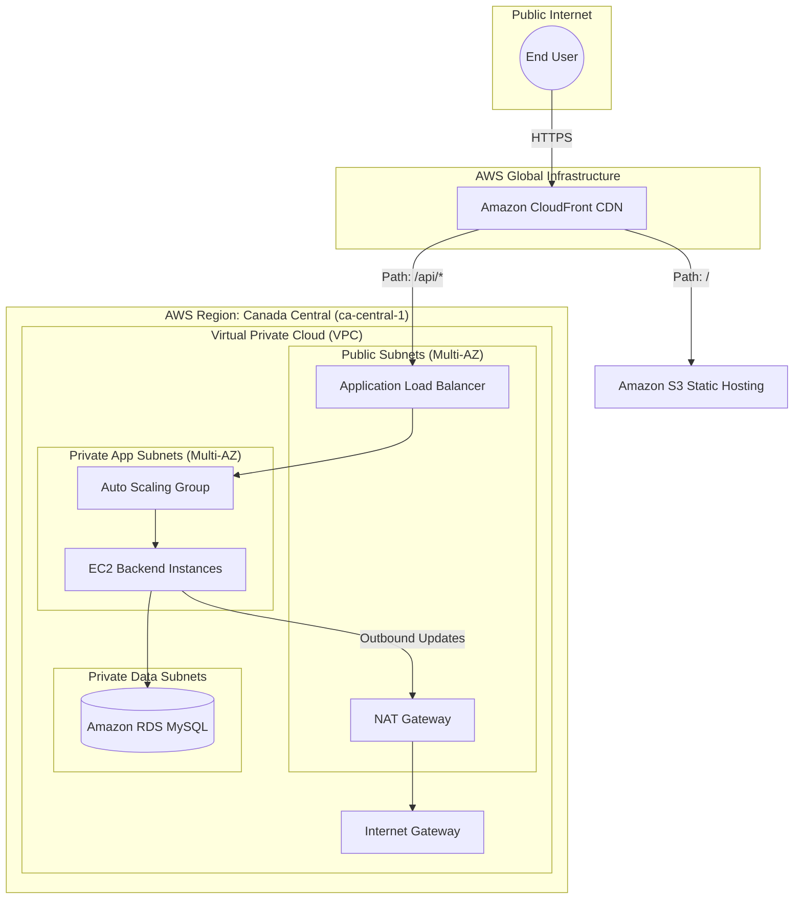

# AWS Cloud Master: Three-Tier Scalable Architecture
[](https://aws.amazon.com/)
[](https://www.terraform.io/)
[](https://github.com/features/actions)
[](https://reactjs.org/)

A production-ready, highly available **Three-Tier Architecture** on AWS, fully automated with **Terraform** and **GitHub Actions (OIDC)**. This project demonstrates advanced cloud engineering patterns including secure VPC design, automated scaling, and unified domain routing via CloudFront.

---

## 🏗️ Architectural Excellence

This project implements a secure, isolated networking environment across multiple Availability Zones (AZs) for maximum resilience.

### Infrastructure Diagram


### 🔐 Security & Networking
*   **True Isolation**: Backend servers and databases reside in **Private Subnets**, completely inaccessible from the direct internet.
*   **OIDC Authentication**: Zero-credential CI/CD using **GitHub Actions OIDC**, eliminating the need for long-lived IAM keys.
*   **Secrets Management**: DB credentials are automatically rotated and retrieved via **AWS Secrets Manager**.
*   **CORS-Free Architecture**: CloudFront acts as a unified entry point, routing traffic to S3 (frontend) or ALB (backend), eliminating CORS issues and ensuring a seamless HTTPS experience.

---

## 🛠️ Technology Stack

| Layer | Technology |
| :--- | :--- |
| **Frontend** | React 18 (Vite), Tailwind CSS |
| **Backend** | Node.js (Express), PM2 Process Manager |
| **Database** | Amazon RDS (MySQL 8.0) |
| **Infrastructure** | Terraform (Modular IaC) |
| **CI/CD** | GitHub Actions with AWS OIDC |
| **Networking** | VPC, ALB, CloudFront, Route 53, NAT Gateway |

---

## � DevOps & Automation
The entire lifecycle is automated to enable **Continuous Deployment**.

### Terraform Modules
Organized into clean, reusable modules:
- `vpc/`: High-availability networking with NAT Gateways for private outbound traffic.
- `alb/`: Application Load Balancer with dynamic health checking.
- `autoscaling/`: Self-healing EC2 fleet with automated bootstrapping (cloning repo, installing deps).
- `rds/`: Secure managed database with subnet group isolation.
- `frontend/`: CDN-first static delivery via S3 and CloudFront.

### GitHub Actions Pipeline
The `deploy.yml` workflow automates the frontend delivery:
1. **OIDC Login**: Securely assumes an IAM Role in AWS.
2. **Build**: Compiles the React application with production optimizations.
3. **Sync**: Deploys the artifacts to S3 with cache-clearing logic.
4. **Invalidation**: Automatically clears CloudFront cache for instant updates.

---

## 🚦 Getting Started

### Prerequisites
- AWS Account with CLI configured.
- Terraform v1.0+ installed.

### Initial Provisioning
1. **Infrastructure**:
   ```bash
   cd terraform
   terraform init
   terraform apply
   ```
2. **Deploy Frontend**:
   Simply push to the `main` branch. GitHub Actions will handle the rest.

### Repository Structure
- `/terraform`: Infrastructure as Code.
- `/frontend`: Client-side React application.
- `deploy.yml`: CI/CD Pipeline definition.

---

## 🎓 Learning Objectives Captured
- Multi-tier VPC implementation and subnet isolation.
- Handling circular dependencies in Terraform (CF <-> ALB).
- Automating EC2 bootstrapping with User Data and Git.
- Designing for security with IAM OIDC and Secrets Manager.

---

## 👤 Author
**Rishi Majmudar**  
Feel free to reach out for collaboration or inquiries!
- **GitHub**: [@Rishi-Cs-ms](https://github.com/Rishi-Cs-ms)
- **LinkedIn**: [Rishi Majmudar](https://linkedin.com/in/rishimajmudar)
- **Website**: [rishimajmudar.me](https://rishimajmudar.me)
